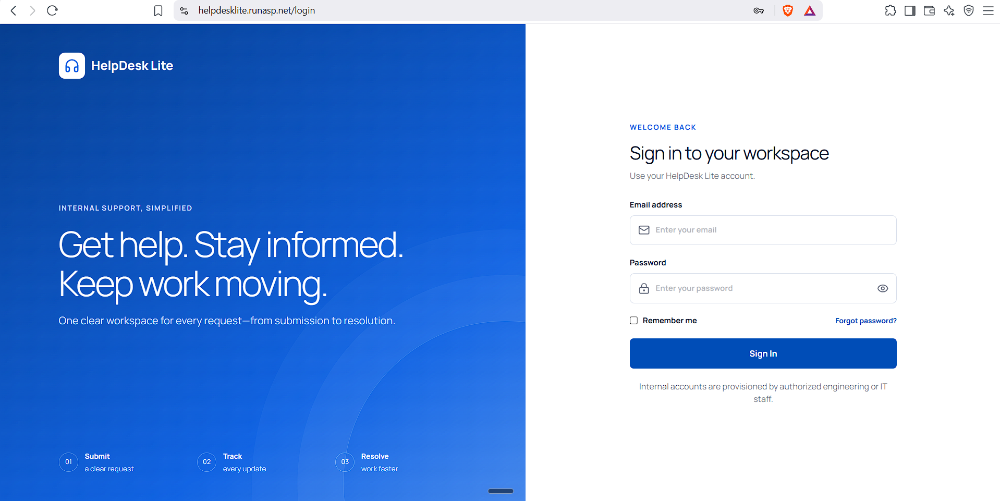
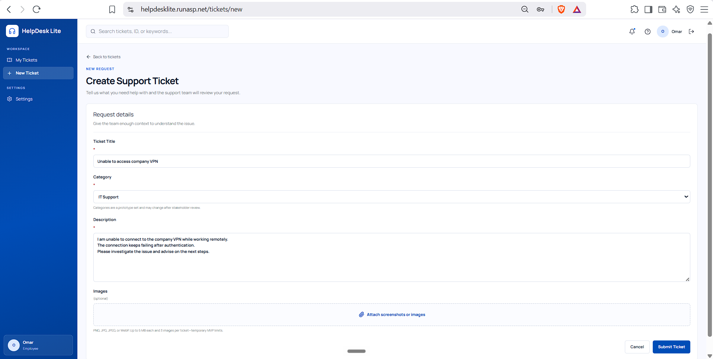
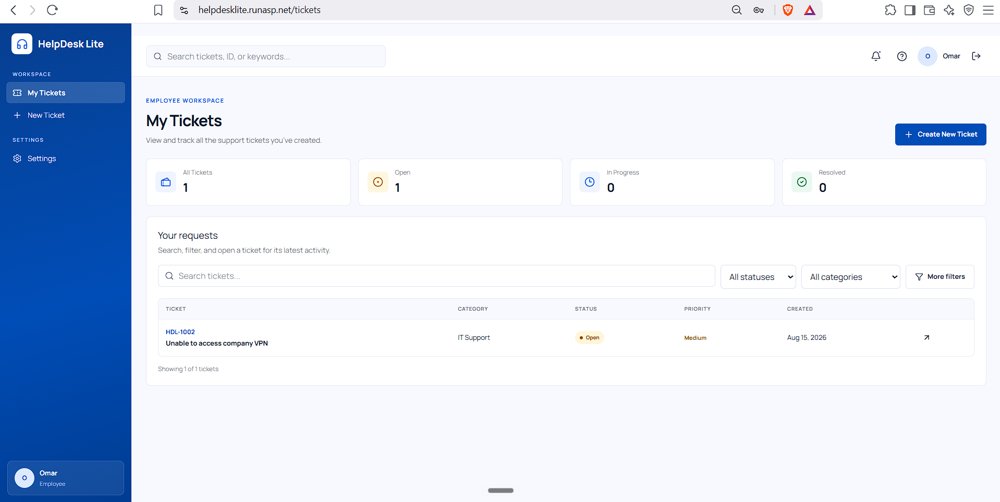
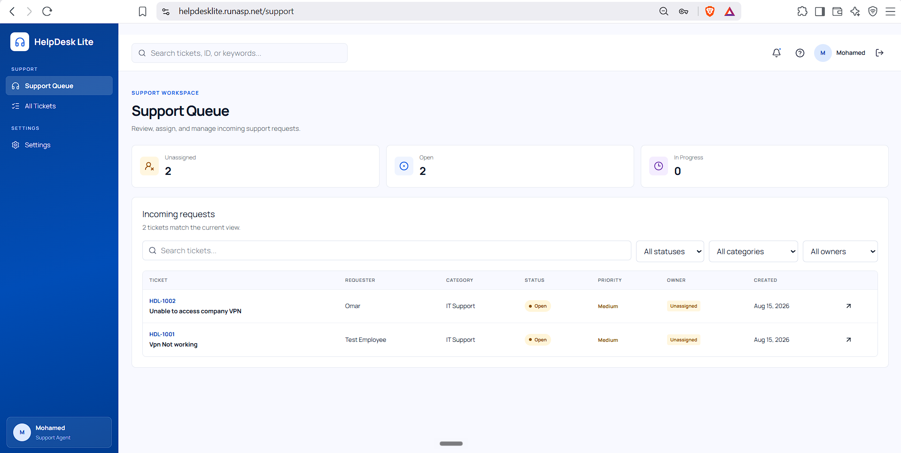
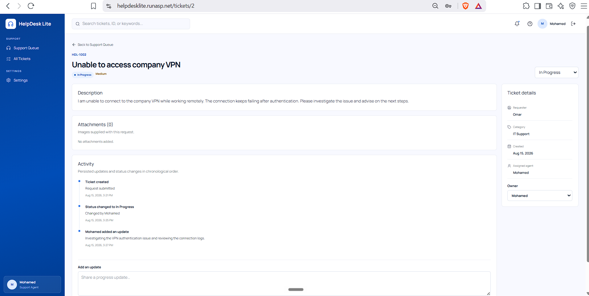
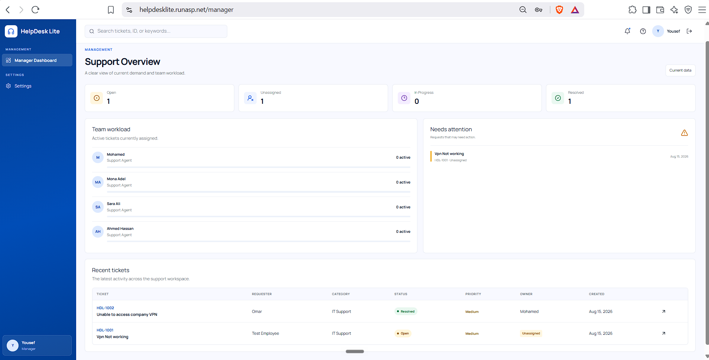
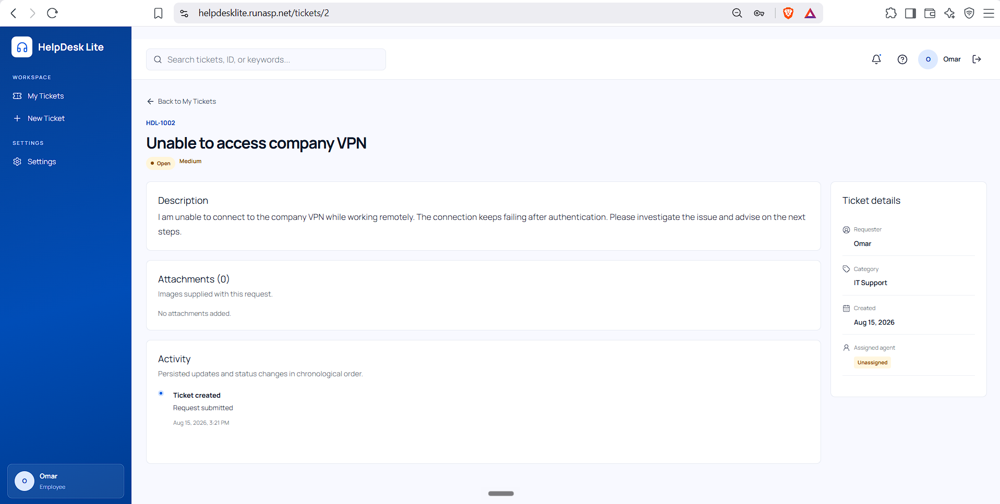
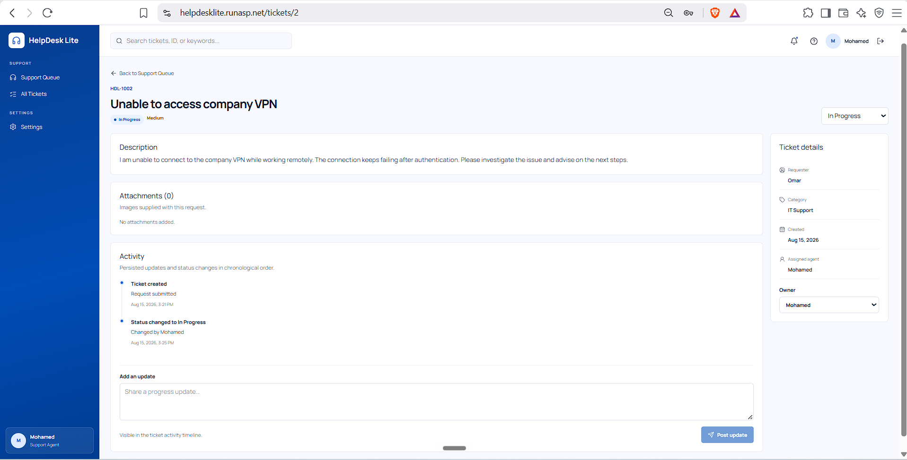
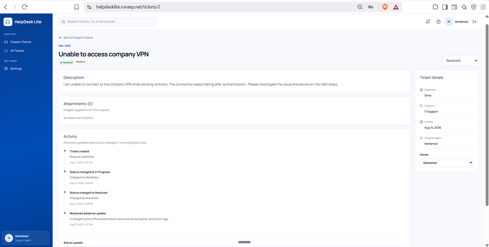

# HelpDesk Lite

**Internal Support Ticketing Workspace**

HelpDesk Lite is a lightweight full-stack helpdesk application for teams that need a clear path from an employee request to support ownership, progress, resolution, and manager visibility.

**Live demo:** [https://helpdesklite.runasp.net](https://helpdesklite.runasp.net)

This repository is a portfolio project demonstrating React, TypeScript, ASP.NET Core 9, ASP.NET Core Identity, Entity Framework Core, SQL Server, role-based authorization, secure file handling, integration testing, and single-site IIS deployment.

## Project Overview

### Business Problem

Internal support requests often arrive through email, chat, and informal follow-up. That makes requests easier to miss, ownership unclear, status updates inconsistent, and operational workload difficult to understand.

HelpDesk Lite centralizes that work around a small workflow:

**Submit → Assign → Handle → Resolve → Track**

Employees submit and track their own requests. Support Agents work a shared queue, assign ownership, update status, and post progress updates. Managers receive read-only operational visibility without becoming application administrators.

## Live Demo

Visit [https://helpdesklite.runasp.net](https://helpdesklite.runasp.net).

The live database is intentionally kept without pre-created ticket data. Visitors build the demo data through the real application workflow:

1. Sign in as an Employee.
2. Create a support ticket, optionally with image attachments.
3. Sign out and sign in as a Support Agent.
4. Find the ticket in the support queue and take or assign ownership.
5. Change its status and add a progress update.
6. Resolve the ticket.
7. Sign in as the Manager.
8. Review the resulting metrics, workload, recent tickets, and needs-attention view.

## Demo Accounts

| Role | Email |
| --- | --- |
| Employee | `demo.employee@helpdesklite.local` |
| Support Agent | `demo.agent@helpdesklite.local` |
| Manager | `demo.manager@helpdesklite.local` |

**Demo-only password:** `HelpDeskDemo@2026!`

> These credentials are intentionally public and are provided only for testing the live portfolio demo. The shared password belongs only to these demo accounts.

### Account architecture

Normal public registration requires first name, last name, email, password, and password confirmation. The API always assigns exactly the `Employee` role; the request has no role field, so a public user cannot select `SupportAgent` or `Manager`. New public accounts must confirm their email before normal sign-in. Forgot-password and Identity-backed reset-password flows are available from the sign-in screen.

`SupportAgent` and `Manager` remain controlled roles created through the private `HelpDeskLite.UserProvisioning` console utility. Provisioned accounts are trusted and email-confirmed. Manager remains read-only operational oversight and is not an administrator.

Portfolio Quick Demo Access is separate from registration and publicly offers the privileged SupportAgent and Manager experiences that cannot be self-assigned. It signs reviewers into the corresponding predefined Identity account with a normal non-persistent application cookie. The server still retains the configured Employee demo account for backward compatibility, owns every role-to-account mapping, validates actual role membership, and never sends a demo password to the browser. Demo users can switch between SupportAgent and Manager from the authenticated header; normal users do not see that control. Demo mode never bypasses API authorization.

Recommended portfolio testing flow:

1. For Employee testing, select **Create Account**, confirm the email address, sign in, and exercise the employee ticket workflow. Every public registration receives `Employee` automatically and has no role selector.
2. For privileged-role testing, use **Quick Demo Access → Support Agent** or **Quick Demo Access → Manager**.

### Email configuration

Account confirmation and password reset use Gmail SMTP with `HelpDesk Lite <omarkenawy02@gmail.com>` as the configured sender. The SMTP password is intentionally absent from source and must be supplied through deployment configuration or user secrets.

| Key | Purpose |
| --- | --- |
| `Email__SmtpHost` | SMTP host; `smtp.gmail.com` by default. |
| `Email__SmtpPort` | SMTP STARTTLS port; `587` by default. |
| `Email__Username` | SMTP username. |
| `Email__Password` | Gmail App Password or deployment-managed SMTP secret; required and never committed. |
| `Email__FromEmail` | Sender email; `omarkenawy02@gmail.com`. |
| `Email__FromName` | Sender display name; `HelpDesk Lite`. |
| `Email__FrontendBaseUrl` | Public frontend origin used for confirmation/reset links (for example `https://helpdesklite.runasp.net`). |

Automated tests replace SMTP with an in-memory fake and do not send external email.

## Try the Complete Workflow

The live environment intentionally begins without ticket data. Use this scenario to experience the implemented workflow end to end.

### Step 1 — Employee: submit a request

Sign in as `demo.employee@helpdesklite.local` with `HelpDeskDemo@2026!`.

1. Open **Create Ticket**.
2. Enter a title and description, then select one of the available categories.
3. Optionally attach up to three supported images.
4. Submit the ticket. New tickets are created as **Open** with the current fixed **Medium** priority.
5. Open **My Tickets** and confirm the request appears.
6. Open **Ticket Details** to review its status, assignment, activity, and attachments.

### Step 2 — Support Agent: handle the request

Sign out, then sign in as `demo.agent@helpdesklite.local` with `HelpDeskDemo@2026!`.

1. Open the **Support Queue** and locate the Employee's ticket using the search and filters if needed.
2. Open the ticket and select **Assign to me**, or choose a Support Agent from the Owner control.
3. Change the status from the ticket status control. The available states are **Open**, **In Progress**, **In Review**, and **Resolved**.
4. Add a progress update; it appears in the ticket activity timeline.
5. Set the ticket to **Resolved**. The current implementation also permits reopening by selecting a non-resolved status.

### Step 3 — Employee: track progress

Optionally sign back in as `demo.employee@helpdesklite.local`. Open **My Tickets**, then the ticket. The Employee can see the current status, assigned owner, ticket details, status history, Support Agent updates, and attachment information. Employee access remains limited to tickets they created and does not include Support Agent actions.

### Step 4 — Manager: review operations

Sign out, then sign in as `demo.manager@helpdesklite.local` with `HelpDeskDemo@2026!`.

The Manager dashboard shows Open, Unassigned, In Progress, and Resolved counts; active workload by Support Agent; recent tickets; and tickets needing attention. Managers can open the recent and needs-attention tickets to inspect their details in read-only mode.

The Manager role provides read-only operational oversight. Manager is **not** an administrator and cannot create or manage application users through the website.

```text
Employee
   ↓
Create Ticket
   ↓
Support Queue
   ↓
Support Agent
   ↓
Assign → Update → Resolve
   ↓
Employee Tracking + Manager Visibility
```

## Roles and Permissions

Authorization is enforced by the API as well as reflected in the React interface.

### Employee

- Sign in and sign out.
- Create tickets with title, category, and description.
- View, search, filter, and paginate only their own tickets.
- View ticket status, priority, requester, category, owner, timestamps, activity, and authorized attachments.
- Upload image attachments only to their own tickets.
- Cannot access another employee's ticket or the support/manager endpoints.
- Cannot change ownership, status, or post support progress comments.

### SupportAgent

- View the active Support Queue and the All Tickets view.
- Search by ticket number or title.
- Filter by status, category, and owner, including unassigned work.
- Assign a ticket to any valid Support Agent, take ownership, or clear ownership.
- Change ticket status and resolve or reopen tickets.
- Add progress updates/comments to the ticket timeline.
- View and download authorized attachments.
- Cannot upload ticket attachments through the implemented API.

### Manager

- View all ticket details and attachments in read-only mode.
- View Open, Unassigned, In Progress, and Resolved counts.
- View active ticket workload by Support Agent.
- Open recent and needs-attention tickets from the dashboard.
- Cannot change assignment or status, post comments, upload attachments, or manage users.
- Is not an application administrator.

## Core Features

- ASP.NET Core Identity login/logout/current-user endpoints with cookie authentication.
- Backend-enforced `Employee`, `SupportAgent`, and `Manager` authorization.
- Employee ticket creation with server-side validation.
- Unique `HDL-####` ticket numbers backed by a unique database index.
- Prototype categories: IT Support, Network, Email, Access & Accounts, and Other.
- New tickets start as `Open` with a temporary MVP default priority of `Medium`.
- Employee My Tickets summary, server-side search/filtering, and pagination.
- Support Queue that excludes Resolved tickets by default, plus an All Tickets view.
- Support assignment, status updates, progress comments, and persisted status history.
- Manager dashboard with database-derived metrics, active workload, recent tickets, and needs-attention tickets.
- Secure image attachment upload, preview, authorized open/download, and persisted metadata.
- API input validation, consistent status codes, centralized safe Problem Details for unexpected errors, and server-side logging.
- Responsive Azure Horizon React UI with desktop tables, mobile cards/navigation, loading states, empty states, error feedback, and a 404 page.
- Lightweight unauthenticated health endpoint.

The Settings screen contains personal/prototype preference controls only. Notification choices are illustrative and are not a persisted notification system.

## Ticket Workflow

```text
Employee
   |
   +-- Create Ticket (Open, Medium priority)
   |       |
   |       +-- Optional employee image uploads
   |
Support Queue (Resolved excluded by default)
   |
   +-- Assign to Support Agent / take ownership / clear ownership
   |
   +-- Open <-> In Progress <-> In Review <-> Resolved
   |       |
   |       +-- Support progress updates
   |
Employee tracking + Manager read-only visibility
```

Implemented statuses are:

- `Open`
- `InProgress` (displayed as **In Progress**)
- `InReview` (displayed as **In Review**)
- `Resolved`

The current MVP does not enforce a transition matrix. A Support Agent may set any implemented status from the current status. Status changes create `TicketStatusHistory`; setting `Resolved` records `ResolvedAt`, and changing away from Resolved clears it.

## Attachments

Employees can add up to three images to a ticket they own. Current configurable defaults are:

- PNG (`.png`, `image/png`)
- JPEG (`.jpg` or `.jpeg`, `image/jpeg`)
- WebP (`.webp`, `image/webp`)
- Maximum 5 MB per image
- Maximum 3 images per ticket

Validation occurs in both the UI and API. The API verifies file size, per-ticket count, filename/extension, declared MIME type, and PNG/JPEG/WebP magic bytes. Physical filenames are random GUID values; original filenames are metadata only.

Metadata is stored in SQL Server. Files are stored beneath the configured content-root-relative location:

```text
AttachmentStorage__RootPath=App_Data/attachments
```

The directory is outside `wwwroot` and is not exposed as static content. Every list/open/download request passes through ticket authorization, and physical server paths are never returned to the browser.

### Persistent data warning

`App_Data/attachments` is runtime application data and must survive deployments. Deployment procedures must preserve the directory and its write permissions; the repository does not automate that persistence. Attachment metadata in SQL Server and the separate physical files must be backed up and kept consistent. Replacing website files must not silently erase the configured persistent attachment directory.

## Tech Stack

### Frontend

- React 19
- TypeScript 6
- Vite 8
- React Router 8
- Tailwind CSS 4
- Lucide React
- Oxlint

### Backend

- C# / .NET 9
- ASP.NET Core Web API
- ASP.NET Core Identity
- Cookie authentication and role authorization
- Problem Details and centralized exception handling

### Data

- Entity Framework Core 9
- SQL Server / MSSQL
- Checked-in EF Core migrations

### Testing and deployment

- xUnit
- `Microsoft.AspNetCore.Mvc.Testing`
- EF Core InMemory test databases
- Temporary isolated attachment storage in integration tests
- Git and GitHub
- MonsterASP.NET, IIS, ASP.NET Core Module V2, and WebDeploy-compatible publish output

## Architecture

```text
Browser
   |
React + TypeScript SPA
   |
relative /api requests + secure Identity cookie
   |
ASP.NET Core Web API
   |
Services + backend role/ownership authorization
   |
Entity Framework Core
   |
SQL Server

Ticket attachments:
SQL metadata + protected files outside wwwroot
```

In Development, Vite serves the frontend at `http://localhost:5173`, the API runs at `http://localhost:5098`, and Vite proxies `/api` to the backend.

In Production, `dotnet publish` builds the React application and includes it under the API's published `wwwroot`. ASP.NET Core serves the SPA and API from one origin. Non-API client routes fall back to `index.html`; unmatched `/api/...` paths remain JSON 404 responses.

## Repository Structure

```text
/
├── src/                                  React application
│   ├── api/                              Credentialed API clients and DTO mapping
│   ├── components/                       Layout, ticket, dashboard, and UI components
│   ├── context/                          Session and small ticket helpers
│   └── Pages/                            Routed application screens
├── public/                               Static frontend assets
├── backend/
│   ├── HelpDeskLite.Api/                 Web API, Identity, EF Core, services, migrations
│   ├── HelpDeskLite.Api.Tests/           API, authorization, attachment, provisioning tests
│   ├── HelpDeskLite.UserProvisioning/    Explicit internal account provisioning console
│   └── HelpDeskLite.sln
├── package.json
├── vite.config.ts
└── README.md
```

## Database Model

- `ApplicationUser` extends `IdentityUser` with a required legacy display name plus nullable, 50-character `FirstName` and `LastName` columns. Public registration requires both names; nullable columns keep existing users compatible.
- `Ticket` stores number, title, description, validated category, status, priority, requester, optional assignee, and UTC-oriented timestamps.
- `TicketComment` stores Support Agent progress updates and authors.
- `TicketStatusHistory` records initial status and later status changes with actor and timestamp.
- `TicketAttachment` stores ticket association, original/generated filenames, MIME type, byte size, uploader, and timestamp; image bytes are not stored in SQL Server.

Tickets relate to one requester, an optional Support Agent owner, and collections of comments, status history, and attachments. Important lookup fields have indexes, and ticket numbers are unique. Schema changes are managed through EF Core migrations; the application does not use `EnsureCreated` for its SQL Server database.

## Authentication and Authorization

ASP.NET Core Identity handles users, password hashing, login, lockout, cookies, and role membership. Authentication uses an HTTP-only `HelpDeskLite.Auth` cookie rather than browser-stored bearer tokens.

The only application roles are exactly:

- `Employee`
- `SupportAgent`
- `Manager`

Every account is an Identity **user** with exactly one supported application role. Public registration creates Employee accounts only. There is no Admin role or hosted user-management interface; privileged real accounts remain internally provisioned.

The API returns 401 for unauthenticated access and 403 for authenticated role or ownership violations. Employee ticket ownership checks and all mutation restrictions are enforced server-side, not only hidden in React.

## Internal User Provisioning

Because HelpDesk Lite is an internal application, engineering/IT creates accounts with the separate `HelpDeskLite.UserProvisioning` console utility. It uses the same `ApplicationUser`, `ApplicationDbContext`, Identity services, and password policy as the API.

Run interactively from the repository root:

```powershell
dotnet run --project backend\HelpDeskLite.UserProvisioning\HelpDeskLite.UserProvisioning.csproj
```

The tool prompts for display name, email, role, password, and confirmation. Password input is hidden in an interactive console. Valid roles are `Employee`, `SupportAgent`, and `Manager` (or interactive selections 1, 2, and 3).

Name, email, and role may be supplied safely as options; plaintext passwords are not accepted as command-line arguments:

```powershell
dotnet run --project backend\HelpDeskLite.UserProvisioning\HelpDeskLite.UserProvisioning.csproj -- --name "New Employee" --email "employee@example.com" --role Employee
```

For intentional automation only, the password may come from `HELPDESKLITE_PROVISIONING_PASSWORD`. The tool rejects duplicate emails, ensures only the three expected roles exist, assigns exactly the selected role, and attempts to delete a newly created account if role assignment fails.

To target MonsterASP MSSQL from a trusted local PC:

```powershell
$env:ConnectionStrings__DefaultConnection="REMOTE_MONSTERASP_CONNECTION_STRING"
dotnet run --project backend\HelpDeskLite.UserProvisioning\HelpDeskLite.UserProvisioning.csproj
Remove-Item Env:ConnectionStrings__DefaultConnection
Remove-Item Env:HELPDESKLITE_PROVISIONING_PASSWORD -ErrorAction SilentlyContinue
```

Apply migrations first. Never share or commit account passwords or database credentials.

## Local Development Setup

### Prerequisites

- Git
- .NET 9 SDK
- Node.js and npm
- SQL Server accessible from the development machine

### 1. Clone and restore

```powershell
git clone https://github.com/Omar02646/helpdesk-lite.git
cd helpdesk-lite
npm ci
dotnet tool restore
dotnet restore backend\HelpDeskLite.sln
```

### 2. Configure SQL Server

The checked-in `appsettings.json` contains a local Windows-authentication default for a database named `HelpDeskLite`. Override it without editing tracked configuration when necessary:

```powershell
$env:ConnectionStrings__DefaultConnection="Server=YOUR_SQL_SERVER;Database=HelpDeskLite;Trusted_Connection=True;TrustServerCertificate=True"
```

### 3. Apply migrations

```powershell
dotnet tool run dotnet-ef database update --project backend\HelpDeskLite.Api\HelpDeskLite.Api.csproj --startup-project backend\HelpDeskLite.Api\HelpDeskLite.Api.csproj
```

### 4. Configure optional Development seed users

```powershell
$env:SeedUsers__Password="CHOOSE_A_DEVELOPMENT_ONLY_PASSWORD"
```

The value must satisfy the Identity password policy and must not be committed.

### 5. Start the API

```powershell
dotnet run --project backend\HelpDeskLite.Api\HelpDeskLite.Api.csproj
```

API: `http://localhost:5098`

### 6. Start the frontend in another terminal

```powershell
npm run dev
```

Frontend: `http://localhost:5173`

## Configuration

Use .NET configuration providers or environment variables for secrets. Double underscores map environment variables to nested configuration keys.

| Setting | Scope | Purpose |
| --- | --- | --- |
| `ConnectionStrings__DefaultConnection` | Development, Production, and provisioning | SQL Server connection setting. The checked-in value is a local Development default; Production and remote provisioning must supply their own value securely. |
| `AttachmentStorage__RootPath` | Optional Development/Production override | Protected physical attachment directory. The default is the content-root-relative `App_Data/attachments`; Production should use storage that persists across deployments. |
| `AttachmentStorage__MaxFileSizeBytes` | Optional override | Per-image size limit. Default: 5,242,880 bytes. |
| `AttachmentStorage__MaxFilesPerTicket` | Optional override | Attachment count limit. Default: 3. |
| `SeedUsers__Password` | Development only | Password used by `DevelopmentSeeder`; never configure on the production website. |
| `HELPDESKLITE_PROVISIONING_PASSWORD` | Optional, provisioning process only | Password input for intentional automation; interactive provisioning uses hidden password entry instead. Clear the variable immediately afterward. |
| `ASPNETCORE_ENVIRONMENT` | Development/Production hosting concept | Selects environment behavior; the deployed site runs as `Production`. |

Do not commit real SQL, MonsterASP, WebDeploy, or user credentials. The repository ignores local development settings, build output, and development attachment storage.

## Development Demo Seeder

`DevelopmentSeeder` exists to simplify local development and testing. It runs only when the API environment is `Development` and:

- Applies pending EF Core migrations.
- Ensures the three application roles exist.
- Creates or updates the five legacy development identities and the three configured portfolio demo identities when `SeedUsers__Password` is configured. Demo identities are confirmed and repaired to exactly their mapped role without deleting unrelated users.
- Adds three sample tickets only when the ticket table is empty.

It does not run automatically in Production and is not the normal production account-management mechanism. Production and other intentional internal account creation use `HelpDeskLite.UserProvisioning`. The production demo does not seed tickets automatically.

## Testing

Run the complete backend suite:

```powershell
dotnet test backend\HelpDeskLite.sln
```

The suite uses xUnit, an in-memory EF Core database, a test authentication handler, `WebApplicationFactory`, and temporary attachment directories. Coverage includes:

- Employee ticket isolation and role mutation restrictions.
- Support Agent assignment and status changes.
- Manager read-only restrictions.
- Authentication responses, pagination scope, and active queue behavior.
- Attachment upload/download authorization, limits, file types, and signatures.
- User creation for all three roles, duplicate email rejection, unsupported roles, password policy, and exact role assignment.

Current verified result: **26 passed, 0 failed, 0 skipped**.

## Build and Publish

Frontend checks:

```powershell
npm run lint
npm run build
```

Backend checks:

```powershell
dotnet restore backend\HelpDeskLite.sln
dotnet build backend\HelpDeskLite.sln
dotnet test backend\HelpDeskLite.sln
```

Create a production publish:

```powershell
dotnet publish backend\HelpDeskLite.Api\HelpDeskLite.Api.csproj -c Release
```

The API project publish target runs `npm ci` when frontend dependencies need restoration, runs the Vite production build, and includes `dist` under published `wwwroot`. The output is under:

```text
backend/HelpDeskLite.Api/bin/Release/net9.0/publish/
```

The ASP.NET Core Web SDK generates the IIS `web.config` for ASP.NET Core Module V2.

## Production Deployment

The intended source repository is [https://github.com/Omar02646/helpdesk-lite](https://github.com/Omar02646/helpdesk-lite), and the live site remains [https://helpdesklite.runasp.net](https://helpdesklite.runasp.net). The deployment flow is:

```text
GitHub
   ↓
Release Publish
   ↓
WebDeploy
   ↓
MonsterASP / IIS
   ↓
SQL Server
```

Deployment requires `ASPNETCORE_ENVIRONMENT=Production`, a production `ConnectionStrings__DefaultConnection`, and a writable persistent attachment path such as `App_Data/attachments`. Apply EF Core migrations from a trusted local machine before provisioning accounts. Upload the contents of the publish directory, not an additional parent folder.

Do not commit or document the real database host credentials, database password, WebDeploy profile/password, or provisioning password. After deployment, verify authentication, direct SPA route refreshes, authorization, database writes, and attachment persistence.

## Health Check

```http
GET /health
```

Healthy response:

```json
{"status":"Healthy"}
```

The endpoint is intentionally lightweight and does not expose database or hosting diagnostics.

## Security Highlights

- ASP.NET Core Identity password hashing and validation.
- Unique emails, confirmed internal accounts, five-attempt lockout, and 15-minute lockout duration.
- HTTP-only, SameSite Strict authentication cookie with eight-hour sliding expiration.
- Secure cookies, HTTPS redirection, and HSTS outside Development.
- Backend role and employee ownership authorization with API-friendly 401/403 responses.
- Relative same-origin production API calls; authentication tokens are not stored in localStorage.
- Request validation and generic logged Problem Details for unexpected failures.
- Attachment extension, MIME, size, count, magic-byte, path-containment, and access validation.
- Random physical attachment filenames outside the public web root.
- Development seeding disabled in Production.
- Secrets and runtime attachment data excluded from Git.

## V1 Scope and Intentional Non-Goals

HelpDesk Lite deliberately focuses on a small internal workflow. The current scope does not include:

- An Admin UI/role or public selection of privileged roles.
- External customer support or multi-company tenancy.
- Automatic assignment or complex workflow automation.
- Advanced SLA, escalation, or reporting.
- Knowledge Base.
- AI classification or chatbot features.
- Slack, Microsoft Teams, or other messaging integrations beyond transactional account email.
- Real-time SignalR updates.

## Future Improvements

Potential future iterations—not current functionality—could include notifications, a Knowledge Base, richer operational reporting, SLA/escalation rules, cloud/object attachment storage, malware scanning, and deeper audit tooling.

## Screenshots

These screens demonstrate the main Employee → Support Agent → Manager workflow.

### Login

Role-based sign-in entry point for HelpDesk Lite.



### Create Ticket

Employee request form with category, description, and optional image attachments.



### Employee — My Tickets

Employee workspace for finding and tracking submitted requests.



### Support Agent — Support Queue

Support workspace for searching, filtering, and opening active requests.



### Support Agent — Ticket Progress

Ticket activity view showing ownership, status, and a Support Agent progress update.



### Manager Dashboard

Read-only operational overview of ticket demand and Support Agent workload.



<details>
<summary>Additional workflow screenshots</summary>

### Ticket Details



### Ticket In Progress



### Resolved Ticket



</details>
